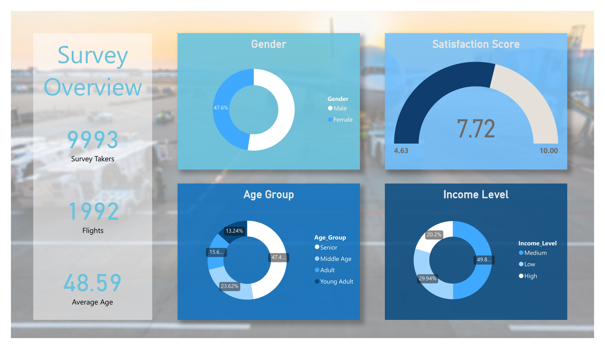
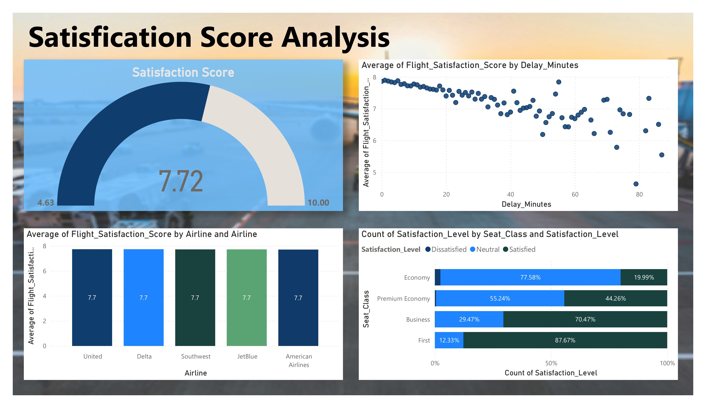
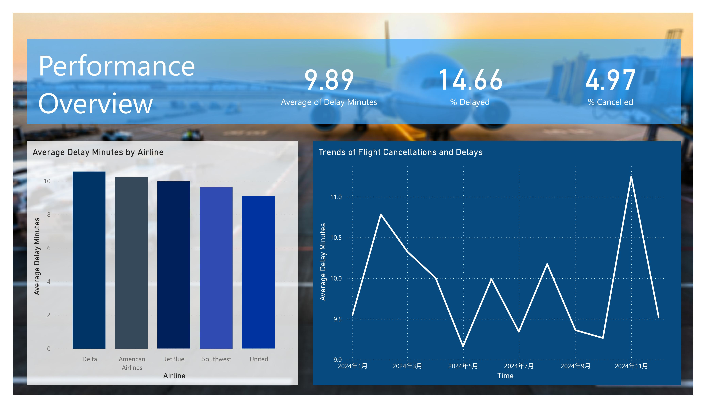

# Airline Customer Satisfaction Analysis Dashboard

## Project Summary

This detailed analysis investigates customer satisfaction trends within the airline sector, utilizing data from 9,993 passengers across 1,992 flights. The findings provide valuable insights into customer behavior, service quality trends, and the interplay of various factors influencing passenger satisfaction.

## Key Findings & Trend Analysis

### 1. Customer Satisfaction Trends

The overall satisfaction score of 7.72 out of 10 indicates a generally positive, though not exceptional, customer experience. Notable observations include:

- **Satisfaction Disparity by Class**
   - There is a significant difference between premium and economy classes
   - First Class boasts a high satisfaction rate of 87.67%
   - Economy class, however, has a troublingly low satisfaction rate of 19.99%
   - This highlights a considerable gap in service quality that requires attention
- **Demographic Influence**
   - Senior travelers (47.4% of respondents) form the largest customer group
   - Middle-income passengers make up nearly half (49.8%) of all travelers
   - This indicates a need for tailored services for these important demographics

### 2. Service Performance Trends

- **Delay Analysis**
   - The average delay is 9.89 minutes, impacting 14.66% of flights
   - There are notable differences in airline performance:
   - United Airlines excels in punctuality
   - Delta Airlines has the highest delays and needs improvement
   - A cancellation rate of 4.97% points to potential operational stability issues
- **Correlation with Customer Experience**
   - There is a strong negative correlation between delay times and satisfaction scores
   - Satisfaction significantly declines after delays of 40 minutes
   - This underscores the critical need for timely performance

### 3. Booking Behavior & Customer Preferences

- **Check-in Method Trends**
   - There is a well-balanced distribution among various check-in options:
   - Online (25.31%)
   - Traditional desk (25.41%)
   - Mobile app (24.59%)
   - Airport kiosk (24.70%)
   - This reflects the successful implementation of a multi-channel strategy
- **Pricing Trends**
   - Price range: $20.05 - $830.44 (Average: $349.12)
   - Booking habits show a consistent preference for 60-day advance reservations
   - Price sensitivity varies greatly across income levels

### 4. Strategic Recommendations

#### Immediate Focus Areas

1. **Standardizing Service Quality**
   - Bridge the satisfaction gap between premium and economy classes
   - Establish uniform service standards across all flight classes
2. **Enhancing Operational Efficiency**
   - Aim to reduce delay times for Delta Airlines
   - Create stronger delay prevention strategies
3. **Digital Advancements**
   - Capitalize on the balanced use of check-in methods
   - Improve mobile app functionalities to encourage digital usage

#### Long-term Strategic Goals

1. **Improving Customer Experience**
   - Design targeted programs for senior travelers
   - Develop service packages tailored for middle-income customers
2. **Optimizing Pricing Strategies**
   - Introduce dynamic pricing based on booking behaviors
   - Create pricing strategies specific to different income segments
3. **Establishing Service Recovery Protocols**
   - Set clear guidelines for managing delays
   - Improve communication during service interruptions

## Technical Implementation

### Tools & Technologies

- **Main Platform**: Power BI
- **Data Processing**: Advanced DAX formulas
- **Visualization**: Interactive dashboards featuring various chart types

### Dashboard Features

- Real-time performance metrics
- Indicators of customer satisfaction
- Tools for demographic analysis
- Visualizations of booking patterns
- Analysis of price trends

## Future Development Opportunities

1. **Integration of Predictive Analytics**
   - Develop models for predicting delays
   - Create capabilities for predicting customer churn
2. **Enhanced Segmentation**
   - Conduct deeper demographic analyses
   - Recognize behavioral patterns
3. **Real-time Monitoring**
   - Track satisfaction levels live
   - Trigger immediate service recovery actions

## Project Impact

This analysis offers practical recommendations for airlines to:

- Streamline service delivery
- Boost customer satisfaction
- Increase operational efficiency
- Foster revenue growth with focused strategies
  The results highlight the intricate relationship between service quality, customer satisfaction, and operational performance within the airline sector, establishing a basis for decisions informed by data.

## Interactive Dashboard

View the complete [Power BI Dashboard](https://app.powerbi.com/reportEmbed?reportId=dbc52286-01cd-4f7a-8077-a5f91befaade&autoAuth=true&ctid=a8eec281-aaa3-4dae-ac9b-9a398b9215e7)
